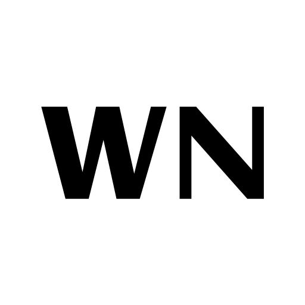

## Hi there, I'm Wendy! 👋

<!--
**wendyyng/wendyyng** is a ✨ _special_ ✨ repository because its `README.md` (this file) appears on your GitHub profile.

Here are some ideas to get you started:

- 🔭 I’m currently working on ...
- 🌱 I’m currently learning ...
- 👯 I’m looking to collaborate on ...
- 🤔 I’m looking for help with ...
- 💬 Ask me about ...
- 📫 How to reach me: ...
- 😄 Pronouns: ...
- ⚡ Fun fact: ...
-->

  My name is Wendy and right now my focus is to learn everything that is related to Web Development 🖥️ 
  

<!--### ⚡ Fun fact:
- I have a background in international relations and accounting
- I have lived in 5 countries and speak 4 languages: English, Mandarin, Japanese and Malay -->

### 📫 How to reach me:

&nbsp;&nbsp;

&nbsp;&nbsp;

&nbsp;&nbsp;
